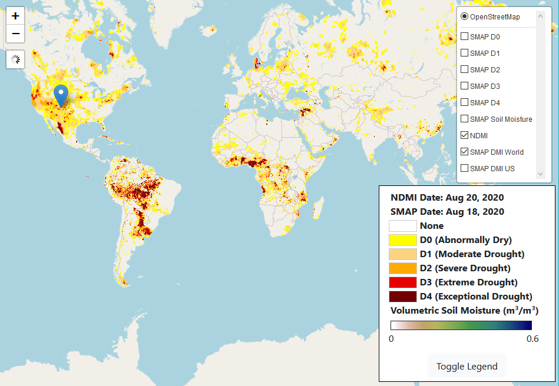

# PODPAC Drought Monitor

Drought monitoring app built using [PODPAC](https://podpac.org).

To see it in action, click on [Drought Monitor](https://creare-com.github.io/podpac-drought-monitor), or click on the image below.
[](https://creare-com.github.io/podpac-drought-monitor)


## Serve

If you have Python 3 installed, open a terminal in the  `src/` directory and run:

```bash
$ python -m http.server 8000 --bind localhost
```

Navigate to your browser and type the url: `http://localhost:8000/`. 
Reload your browser to apply changes after editing the source.
